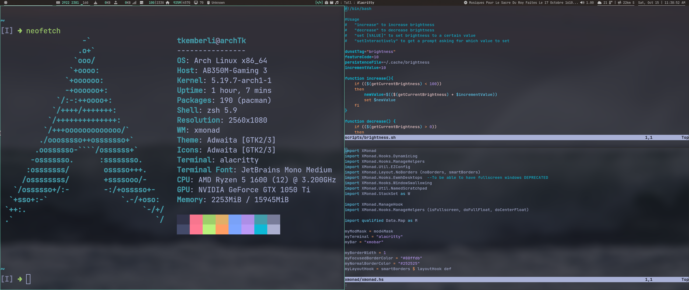

# dotfiles
## Linux configuration files for my Arch installation

[Arch](https://archlinux.org/) is a very minimalist distro. Upon installing it, you are greeted by a blinking TTY screen; from there, you must pick and choose every aspect of your environment, such as: display server, network manager, desktop, etc...

These dotfiles reflect my joyce of packages and their configurations.
I haven't riced them to the moon (yet), since I prefer usability over bling.

Highlights are:

| | | |
|---|---|---|
|Xorg|Display server|I choose it over Wayland, for the simple fact that Wayland isn't working too well with proprietary Nvidia drivers - And open source Nvidia drivers have terrible performance, unfortunately|
|Picom|Compositor|While I do prefer usability to bling, Picom offers some very cool, unnecessary blurring effects
|XMonad|Window manager|A very minimalist and extensible window manager written in Haskell. Basically, you have to drop code for every advanced feature, but the possibilities are endless. Very cool.
|Xmobar|Status bar|Same as above
|Alacritty|Terminal emulator|Blazing fast, GPU-accelerated terminal emulator

What's cool about using a configurable window manager instead of a full desktop environment (like GNOME) is how much control you have over your workflow. For example, you can set up so specifics IDEs are spawned on specifics workspaces.

Also, check out my [bash scripts](https://github.com/tkemberli/Bash-Scripts.git) repo. Those are some scripts for adding a few features to the environment.

### Future plans:
- Make it so on every boot, the colorscheme changes (easy)
- Write my package list
- Whatever new idea comes to mind

---
Some pictures:

Default window positioning: 1 big window to the left and several smaller to the right. The colorscheme for my terminal is [Tokyo Night](https://github.com/folke/tokyonight.nvim)
\
\
\

Clicking on the taskbar icons brings down terminals with information related to those icons